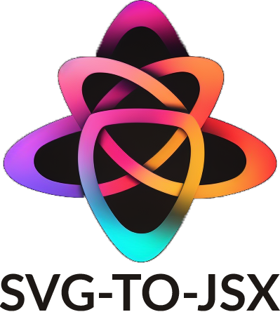

# SVG-TO-JSX

<div style="display: flex; justify-content: center"></div>


<div style="text-align: center; margin-bottom: 16px;">Convert SVGs to Dynamic TSX React Components</div>


- ✅ JSX props (`stroke-width` to `strokeWidth`, `stroke-linecap` to `strokeLinecap`, etc.)
- ✅ Dynamic attributes (`size`, `color`, `stroke`, `strokeWidth`, etc.)
- ✅ Added standard props (`className`, `style`, etc.)
- ✅ Prettier formatting

## Getting Started

Get started by cloning the repository and running the `init` command which will created the required `input` and `output` folders as well as setup a default `svgtojsx.config.js` file (view [Configurations](#configurations) for more information).

```shell
git clone git@github.com:DominicF96/svg-to-jsx.git
cd svg-to-jsx
npm install
npm run init
```

Once your project is initialized, you can start adding your SVGs to the `input` folder. Your icon SVGs should be named as such; `snake_case_component_name-icon_category.svg`.

Then, run the `start` command to generate the dynamic JSX React components.

```shell
npm run start
```

This will start the conversion of your SVGs into dynamic JSX React components. The generated components will be placed in the `output` folder.

The tool also generates an `Icon.map.ts` file which contains a map of all the generated components and their categories. This file is used as a dictionary of icons, to facilitate showing the icons in Storybook or any other alternative.

The resulting icons can be used in combination with the provided `component/Icon` component, which is a wrapper around the generated icons.

## Configurations

You can configure SVGtoJSX a `svgtojsx.config.js` file in the root of the project to configure a few parameters;

```js
// svgtojsx.config.js
module.export = {
  input: './input', // The folder where the SVGs are located
  output: './output', // The folder where the JSX components will be generated
  svg: {
    viewBox: '0 0 32 32', // Enforce a viewBox for all the SVGs
  },
  jsx: {
    // JSX options
    fileCase: 'pascal', // The case of the generated file name (only supports pascal)
    typescript: {
      enabled: true, // Whether to generate TSX or JSX (JSX is not currently supported)
    },
    prettier: {
      enabled: true, // Whether to format the generated JSX
      config: "./", // The path to the prettier config file
    },
    defaultProps: {
      size: 32, // Default size
      color: '#000', // Default color
      strokeWidth: 2, // Default strokeWidth
      className: '', // Default className
    },
    restProps: true, // Whether to add the {...rest} props to the JSX element
  },
};
```

## Designing a Uniform Iconset

Here are some guidelines explaining how we build uniform, professional iconsets.
We start with the assumption that we'll need to display the iconset in a way that's easy to navigate and search through.

Any icon that does not meet these requirements will throw a warning/error.

**Errors (Requirements)**

- SVG file name should be formatted as follows: `{snake_case_icon_id}-{category}.svg`

**Warnings**
- SVG shouldn't use `fill`, instead use `stroke` and `strokeWidth`
- SVG shouldn't use `style`, but if it's required, the JSX will have to be adjusted manually

**Note:** If the provided `category` is not found in the config file, the icon will be placed in the `misc` category, regardless of the provided category.

## Contributions

Contributions are welcome! Please open an issue or submit a pull request.

## Alternatives

- [svgr](https://react-svgr.com/)
